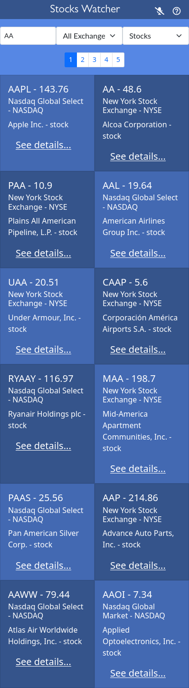
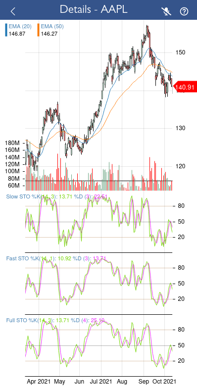
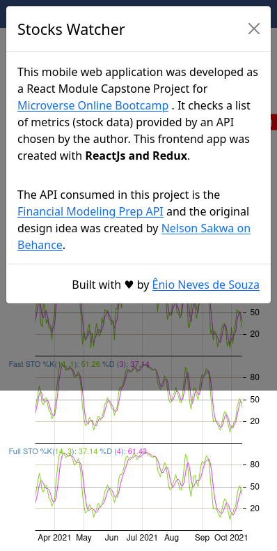

<p align="center">
  <a href="https://www.microverse.org/">
    
  </a>
  <a href="https://github.com/enionsouza/stocks-watcher">
    
  </a>
  <a href="https://github.com/enionsouza/stocks-watcher">
    
  </a>
</p>


# Stocks Watcher

## About

This movile web application was developed as the Capstone Project for Microverse React-Redux Curriculum Module. It was built upon [Financial Modeling Prep API](https://financialmodelingprep.com/developer/docs/) and the original design idea was created by [Nelson Sakwa on Behance](https://www.behance.net/sakwadesignstudio). My task was to check a list of metrics (data stock, in my case) making use of React and Redux. The application allows users to list the Stocks, ETFs, and Funds traded in AMEX, NYSE, and Nasdaq Stock Exchanges and filter their search.

Below, I present some screenshots of the app.

<p align="center">



</p>

## Built With

- HTML, CSS, JavaScript;
- ReactJS, Redux;
- Bootstrap, React Stockcharts;
- VisualStudio Code, Git, & GitHub;

## Pre-requisites

- NodeJs (v. 14.17)
- YarnJs (v. 1.22.10)
- Git

## Live Demo

Live demo for this project can be found in this [link](https://stocks-watcher-enionsouza.netlify.app).

## Getting Started

To run this app running locally,you'll need an API key that you can easily obtain by registering at [https://financialmodelingprep.com/register](https://financialmodelingprep.com/register). You only need a valid email account to register freely. Now, go to the API dashboard and get your newly created API key! Store this token with you, because you'll need it for the next steps:


1. In your terminal, in the folder of your preference, type the following bash command to clone this repository:

```sh
git clone git@github.com:enionsouza/stocks-watcher.git
```

2. Now that you have already cloned the repo run the following commands to get the project up and running:
```sh
cd stocks-watcher
yarn
```

3. For the last step of the process, you just need to edit the file `APIKEY_TEMPLATE.js` in the folder `src/utils/`. Make sure to change the `APIKEY` variable to the one that you got previously from the API dashboard. Now, run:
```sh
yarn start
```

This should start your local server in [http://localhost:3000/](http://localhost:3000/). To stop it, hit `<CTRL> + C` on your keyboard.
## Run tests

To test the App's components and logic, please, run the following command:

```sh
yarn test --watchAll
```
Make sure you have properly provided an API key, as explained in the steps above. When the tests are finished, just hit `q` key to leave the watch mode for the tests.

## Author

👤 **Ênio Neves de Souza**

- GitHub: [@enionsouza](https://github.com/enionsouza)
- Twitter: [@enionsouza](https://twitter.com/enionsouza)
- LinkedIn: [Enio Neves de Souza](https://www.linkedin.com/in/enio-neves-de-souza/)

## 🤝 Contributing

Contributions, issues, and feature requests are welcome!

Feel free to check the [issues page](https://github.com/enionsouza/stocks-watcher/issues).

## Show your support

Give a ⭐️ if you like this project!

## 📝 License

This project is [MIT](./LICENSE) licensed.